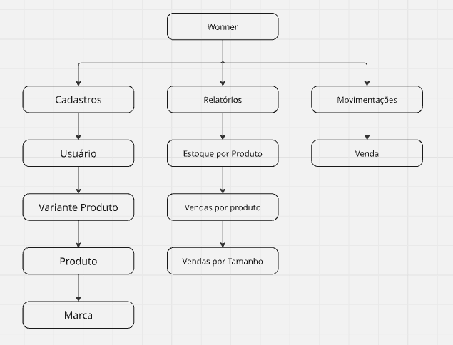
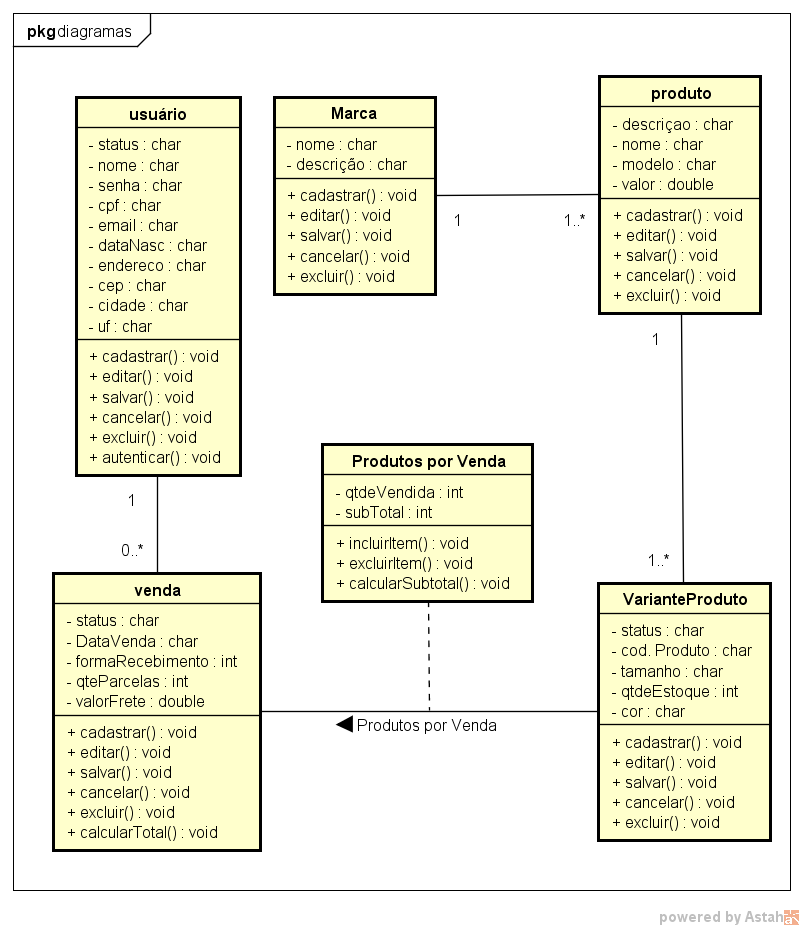
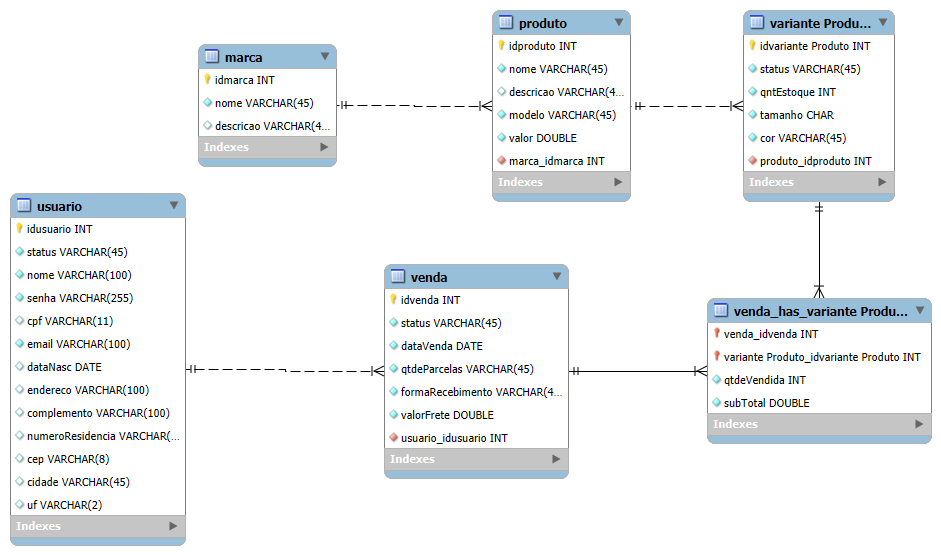

<!--
CÓPIA DE TRABALHO do documento do TCC, transcrita do PDF
"TCC - Projeto Wonner - Google Docs.pdf".

Regra: este arquivo é a VERSÃO CORRENTE do documento. Toda decisão registrada em
DECISOES.md é aplicada aqui no mesmo momento. O PDF/Google Docs é gerado a partir
daqui, nunca o contrário.

Marcações no texto:
  <!-- PENDENCIA: RQ-nn --> aponta o trecho afetado por uma pendência aberta.
  Ao resolver, o texto é corrigido e a marcação apagada.

A seção "Estado do documento" logo abaixo é de trabalho: apagar antes de exportar.
-->

# Projeto Integrador — Wonner.com

**Instituto Federal do Paraná — Umuarama, 2024**

Igor M. Delmonaco
Felipe T. Rodrigues

---

<!-- ═══ SEÇÃO DE TRABALHO — APAGAR ANTES DE EXPORTAR ═══ -->

## Estado do documento

Decisões aplicadas: `D-01` a `D-17` (ver [DECISOES.md](DECISOES.md)).

| Seção | Situação |
|---|---|
| 1.1 – 1.5 | ✅ Escrita · RF001 a RF015 · 3 pendências ainda afetam 1.5 |
| 2.1 Diagrama geral | ⚠️ Texto escrito, **diagrama a redesenhar** (`MD-07`) |
| 2.2 Casos de uso | ⚠️ Texto escrito, **diagrama ausente** |
| 2.3 Diagrama de classes | ✅ Escrita e diagramada · pendências `MD-*`, `DV-*` |
| 2.4 Modelo relacional | ✅ Escrita e diagramada · pendências `MD-*`, `TP-*` |
| 3 Interfaces | ❌ Só o título — nada escrito |
| 4 Implementação (protótipo, DDL, DML, consultas) | ❌ Só o título — nada escrito |
| 5 Referências | ❌ Citações usadas no texto (Visure Solutions, Castro 2016, Brito 2010, Clemente 2024, Ramos 2013, Braz Junior 2007, Araújo 2008) mas a lista não existe |

<!-- ═══ FIM DA SEÇÃO DE TRABALHO ═══ -->

---

## Sumário

1. [Identificação, situação e requisitos](#11-identificação-do-sistema)
   - [1.1 Identificação do sistema](#11-identificação-do-sistema)
   - [1.2 Situação atual](#12-situação-atual)
   - [1.3 Proposta de sistema](#13-proposta-de-sistema)
   - [1.4 Documento de requisitos do sistema](#14-documento-de-requisitos-do-sistema)
     - [1.4.1 Requisitos funcionais](#141-requisitos-funcionais)
     - [1.4.2 Requisitos não funcionais](#142-requisitos-não-funcionais)
     - [1.4.3 Funções do sistema](#143-funções-do-sistema)
   - [1.5 Regras de negócio](#15-regras-de-negócio)
2. [Descrição/modelagem de dados do sistema](#2-descriçãomodelagem-de-dados-do-sistema)
   - [2.1 Diagrama geral do sistema](#21-diagrama-geral-do-sistema)
   - [2.2 Diagrama de casos de uso](#22-diagrama-de-casos-de-uso)
   - [2.3 Diagrama de classes](#23-diagrama-de-classes)
   - [2.4 Diagrama do modelo relacional](#24-diagrama-do-modelo-relacional)
3. [Interfaces](#3-interfaces)
4. [Implementação do sistema](#4-implementação-do-sistema)
5. [Referências](#5-referências)

---

## 1.1 IDENTIFICAÇÃO DO SISTEMA

A Wonner é uma empresa de e-commerce de roupas em fase inicial de desenvolvimento.
O negócio encontra-se em processo de estruturação, com foco na criação de sua
presença digital e na construção de uma base inicial de clientes.

## 1.2 SITUAÇÃO ATUAL

Atualmente, a empresa está concentrada no desenvolvimento de sua plataforma de vendas
online, que será responsável por gerenciar o catálogo de produtos e realizar o
processamento de pedidos. Paralelamente ao desenvolvimento do sistema, a Wonner
também trabalha na definição de sua identidade de marca, estratégias de marketing
digital e estrutura logística para atendimento dos pedidos.

Por ser uma empresa nova no mercado, um dos principais desafios da Wonner é conquistar
visibilidade e credibilidade junto ao público. Para isso, a organização busca utilizar
canais digitais, como redes sociais e campanhas online, como principais meios de
divulgação e aquisição de clientes.

## 1.3 PROPOSTA DE SISTEMA

Nesse momento, as prioridades da empresa estão voltadas para:

- desenvolvimento e implementação do sistema de e-commerce
- cadastro inicial de produtos e organização do catálogo
- definição de processos de venda e entrega
- construção de presença digital e captação dos primeiros clientes

Dessa forma, a Wonner encontra-se em uma fase estratégica de consolidação, onde o
desenvolvimento tecnológico do sistema e a validação do modelo de negócio são fatores
essenciais para o crescimento da empresa.

## 1.4 DOCUMENTO DE REQUISITOS DO SISTEMA

Para Visure Solutions, um documento de requisitos do sistema é um documento detalhado
que descreve todas as necessidades e funcionalidades que um sistema deve atender para
cumprir seus objetivos. Ele serve como uma referência principal para o desenvolvimento
e implementação do sistema, descrevendo o que o sistema deve fazer, além de especificar
restrições, critérios de desempenho e condições de funcionamento.

Para estabelecer prioridade dos requisitos, nas seções 1.4.1 e 1.4.2, foram adotadas as
denominações "essencial", "importante" e "desejável".

- **Essencial** > requisito sem o qual o sistema não entra em funcionamento.
- **Importante** > requisito sem o qual o sistema entra em funcionamento, porém de modo
  não satisfatório.
- **Desejável** > requisito que não compromete as funcionalidades básicas do sistema, o
  sistema pode funcionar de forma satisfatória sem ele e pode ser implementado em
  versões posteriores.

### 1.4.1 Requisitos funcionais

Para Castro (2016), os requisitos funcionais detalham as funcionalidades que o sistema
precisa oferecer. A seguir, estão listados os requisitos funcionais identificados ao
longo do processo de licitação. Cada requisito inclui um código identificador, nome,
descrição, prioridade e o caso de uso associado.

#### 1.4.1.1 [RF001] Cadastro e autenticação

prioridade: Essencial.

O sistema deve permitir a realização do auto-cadastro do usuário, captando as
informações essenciais para identificação e responsabilização do usuário pela compra.

Disponibilizando o devido acesso do usuário, seguro e privado, aos seus respectivos
dados.

#### 1.4.1.2 [RF002] Calcular valores de produtos selecionados

prioridade: Essencial.

O sistema deve apresentar ao pedido de compra todos os dados essenciais dos produtos
selecionados.

#### 1.4.1.3 [RF003] Inserir itens ao carrinho

prioridade: Essencial.

O sistema deve proporcionar ao cliente adicionar uma ou várias variantes de produto ao
seu carrinho, informando a quantidade desejada de cada uma.

O carrinho é **persistente e pertence ao usuário**: seu conteúdo permanece disponível
entre sessões, por tempo indeterminado. Um item deixa o carrinho em apenas duas
situações: quando a compra correspondente é confirmada, ou quando o próprio cliente o
remove.

O carrinho apresenta a disponibilidade e o preço vigente de cada variante, porém **não
reserva estoque e não congela preço** — ambos ocorrem apenas no checkout (RF004). A
expiração ou o cancelamento de um pedido não afetam o carrinho.

#### 1.4.1.4 [RF004] Realizar compra

prioridade: Essencial.

Quando o cliente confirmar a compra, ele será direcionado para uma tela de pagamento,
na qual será realizado o recebimento do valor total dos produtos inseridos no carrinho
e das cobranças de frete.

A tela de pagamento permite ao usuário selecionar os métodos: PIX e cartão de
crédito/débito.

Ao iniciar o checkout, o sistema deve criar o pedido a partir de uma cópia dos itens do
carrinho e **reservar** a quantidade correspondente pelo prazo de **15 minutos**,
tornando-a indisponível aos demais clientes durante esse período. O prazo restante deve
ser exibido ao cliente.

O valor do frete deve ser obtido a partir do cadastro de faixas de CEP, considerando o
CEP de entrega informado, e congelado no pedido no momento do fechamento.

O pedido somente avança para o estado "pago" **após a confirmação do pagamento pelo
provedor**, nunca no momento em que o cliente submete os dados. Enquanto a confirmação
não ocorre, o pedido permanece no estado "aguardando pagamento".

Quando o método selecionado for cartão de crédito, o sistema deve permitir o
parcelamento conforme a regra de negócio correspondente, apresentando ao cliente apenas
as quantidades de parcelas admitidas para o valor do pedido.

#### 1.4.1.5 [RF005] Buscar produto

prioridade: Importante.

O sistema deve proporcionar ao cliente buscar produtos por seus atributos (nome, cor,
modelo, descrição).

<!-- PENDENCIA: MD-01 — "modelo" é texto livre; sem entidade Categoria o filtro não fecha -->

#### 1.4.1.6 [RF006] Classificar produtos

prioridade: Desejável.

Ao apresentar os "cards" de produto o sistema deve ordená-los de acordo com o critério
selecionado pelo usuário.

#### 1.4.1.7 [RF007] Apresentar catálogo de produto

prioridade: Importante.

O sistema deve apresentar os "cards" de produto na tela inicial por intersecções de
produtos com categorias semelhantes pré-definidas.

<!-- PENDENCIA: MD-01 — "categorias pré-definidas" não existem no modelo de dados -->

#### 1.4.1.8 [RF008] Confirmar pagamento

prioridade: Essencial.

O sistema deve receber e processar a confirmação de pagamento enviada pelo provedor,
registrando a data e hora da confirmação, dando baixa definitiva no estoque reservado e
promovendo o pedido ao estado "pago".

O processamento deve ser **idempotente**: a mesma confirmação, recebida mais de uma vez,
não pode produzir baixa de estoque duplicada nem alterar o pedido mais de uma vez.

Cobranças não confirmadas dentro do prazo de validade devem ser marcadas como expiradas,
liberando a reserva de estoque correspondente.

#### 1.4.1.9 [RF009] Manter faixas de frete

prioridade: Essencial.

O sistema deve permitir ao administrador cadastrar, alterar, excluir e pesquisar faixas
de CEP com o respectivo valor de frete e prazo de entrega estimado.

#### 1.4.1.10 [RF010] Apresentar detalhe do produto

prioridade: Essencial.

O sistema deve apresentar a página do produto contendo a galeria de imagens da variante
selecionada, nome, preço, descrição, composição, cuidados, política de envio e devolução,
seleção de cor e tamanho, quantidade disponível e produtos da mesma categoria.

Variantes sem disponibilidade devem ser apresentadas **riscadas** — visíveis, porém não
selecionáveis —, de modo que o cliente identifique a existência da variante e a
indisponibilidade momentânea.

#### 1.4.1.11 [RF011] Consultar pedidos

prioridade: Essencial.

O sistema deve apresentar ao cliente autenticado a relação de seus pedidos com o
respectivo estado, em ordem decrescente de data. Havendo código de rastreio registrado,
ele deve ser exibido junto ao estado do pedido.

#### 1.4.1.12 [RF012] Gerenciar cadastros

prioridade: Essencial.

O sistema deve permitir ao administrador cadastrar, salvar, alterar, cancelar, excluir e
pesquisar os cadastros de marca, categoria, produto, variante de produto, imagens de
variante, faixas de frete e usuários, conforme as funções descritas na seção 1.4.3.

#### 1.4.1.13 [RF013] Processar expedição do pedido

prioridade: Essencial.

O sistema deve apresentar ao administrador os pedidos pagos e permitir o avanço do
respectivo estado ao longo do fluxo de expedição: **separado**, **enviado** e
**entregue**.

O avanço para o estado "enviado" exige o registro do código de rastreio, e a data do
envio deve ser gravada automaticamente.

O administrador não pode alterar itens, quantidades, preços, frete ou valores de pedido
finalizado — apenas avançar o estado e registrar os dados de expedição.

#### 1.4.1.14 [RF014] Recuperar senha

prioridade: Desejável.

O sistema deve permitir ao usuário solicitar a redefinição de sua senha informando o
e-mail cadastrado, recebendo por e-mail um link de uso único e prazo de validade
limitado.

Enquanto este requisito não estiver implementado, o usuário que perder a senha perde o
acesso à conta: a senha é armazenada de forma irreversível e não há outro meio de
restabelecer o acesso.

#### 1.4.1.15 [RF015] Notificar o cliente por e-mail

prioridade: Desejável.

O sistema deve enviar e-mail ao cliente na confirmação do pagamento, contendo os dados
do pedido, e no envio do pedido, contendo o código de rastreio.

O envio das mensagens deve ocorrer de forma assíncrona, de modo que uma falha no serviço
de e-mail não impeça a confirmação do pedido.

### 1.4.2 Requisitos não funcionais

Para Brito (2010), os requisitos não-funcionais representam os atributos de qualidade
que o sistema deve ter ou especificam o desempenho esperado para certas funções.
Elicitados paralelamente aos requisitos funcionais, eles impactam diretamente a
qualidade do sistema.

#### 1.4.2.1 [NF001] Interface

prioridade: Importante.

O sistema deve proporcionar interfaces estilizadas de acordo com o design da empresa,
responsivas e intuitivas ao usuário.

As tecnologias utilizadas para cumprir este requisito serão: TailWind CSS e DaisyUI
para estilização eficiente, e AlpineJs para reatividade.

#### 1.4.2.2 [NF002] Banco de dados

prioridade: Essencial.

O sistema deve implementar um banco de dados gratuito, que permita o estabelecimento de
um histórico íntegro.

<!-- PENDENCIA: TP-07 — sem timestamps de auditoria a premissa de histórico íntegro fica sem base -->

#### 1.4.2.3 [NF003] Escalabilidade

prioridade: Importante.

O sistema deve proporcionar uma arquitetura capaz de suportar o uso simultâneo de todos
os clientes da marca, com margem para crescimento.

#### 1.4.2.4 [NF004] Tempo de resposta

prioridade: Importante.

O sistema deve ter uma latência de no máximo 2 segundos.

### 1.4.3 Funções do sistema

Para todos os módulos do sistema, serão necessárias as seguintes funções/métodos:

- **CADASTRAR** → possibilita a inserção de um novo cadastro no sistema verificando não
  duplicidade
- **SALVAR** → insere o novo registro do cadastro no banco de dados
- **ALTERAR** → possibilita alteração de dados já cadastrados no sistema
- **CANCELAR** → cancela a edição de um cadastro atual
- **EXCLUIR** → exclui um cadastro do sistema, desde que este não tenha nenhum
  relacionamento
- **PESQUISAR** → busca um cadastro existente no sistema e mostra os dados na tela

Para organizar e sistematizar os requisitos do sistema, serão necessários cadastros,
movimentações e relatórios.

Adotaremos a legenda abaixo para organizar os atributos dos cadastros e movimentações:

| Símbolo | Significado |
|---|---|
| `@` | atributo inserido automaticamente |
| `#` | atributo validado |
| `*` | atributo obrigatório (não pode ser nulo) |
| `**` | atributo calculado |

Adotaremos também uma lista de abreviaturas que serão descritas no decorrer do
documento de requisitos:

| Sigla | Significado |
|---|---|
| BD | banco de dados |
| CEP | código de endereçamento postal |
| CNPJ | cadastro nacional de pessoa jurídica |
| CPF | cadastro de pessoa física |
| DN | data nascimento |
| HW | hardware |
| QUANT | quantidade |
| RG | registro geral (identidade) |
| SW | software |

#### A) CADASTROS

Os cadastros são os dados que irão alimentar o sistema a fim de registrar informações
inerentes ao funcionamento do estabelecimento.

1. **Usuário:** `@*código`, `*nome`, `*#CPF`, `*#telefone`, `*endereco`, `*cidade`,
   `*uf`, `*#cep`, `*papel`, `*situacao`, `*email`, `*#senha`
2. **Produto:** `@*código`, `*nome`, `*descrição`, `*modelo`, `*valor`, `composição`,
   `cuidados`, `envioDevolucao`
3. **Variante Produto:** `@*código`, `*#sku`, `*cor`, `*tamanho`, `*situacao`,
   `*qtdEstoque`
4. **Marca:** `@*código`, `*nome`, `*descrição`
5. **Imagem da Variante:** `@*código`, `*@codVarianteProd`, `*arquivo`, `*ordem`
6. **Faixa de Frete:** `@*código`, `*cepInicial`, `*cepFinal`, `*valor`, `*prazoDias`
7. **Item de Carrinho:** `@*código`, `*@codUsuario`, `*@codVarianteProd`, `*qtde`

<!-- PENDENCIA: DV-03 — dataNasc, complemento e numeroResidencia existem no relacional e faltam aqui -->
<!-- PENDENCIA: MD-01 — falta Categoria · MD-02 — falta imagem do produto -->
<!-- PENDENCIA: RQ-09 — falta registro do consentimento LGPD (data/hora/versão dos termos) -->

#### B) MOVIMENTAÇÕES

As movimentações são:

1. **Venda:** `@*código`, `*qntProduto`, `***frete`, `***valorTotal`,
   `*@codVarianteProd`, `*@codUsuario`, `*situacao`, `codigoRastreio`, `@dataEnvio`
2. **Pagamento:** `@*código`, `*@codVenda`, `*metodo`, `*qtdeParcelas`, `*valor`,
   `*situacao`, `#idExterno`, `dataConfirmacao`
3. **Entrada:** `@*código`, `*@codVarianteProd`, `*qntProduto`

Uma venda possui um ou mais pagamentos, um por tentativa de cobrança: uma cobrança
recusada ou expirada permanece registrada e o cliente pode iniciar outra.

<!-- PENDENCIA: DV-01 — codVarianteProd não pertence a Venda; o item de venda é a associativa "Produtos por Venda" -->
<!-- PENDENCIA: MD-05 — Entrada não existe nos diagramas -->
<!-- PENDENCIA: MD-03 — a venda não guarda o endereço de entrega -->
<!-- PENDENCIA: MD-07 — Pagamento e faixa de frete ainda não estão nos diagramas 2.3 e 2.4 -->

#### C) RELATÓRIOS (dashboard)

Os relatórios são a junção de dados e informações de maneira organizada para serem
apresentadas de maneira rápida e organizada de modo a auxiliar em tomada de decisão do
usuário do sistema ou de outro encarregado (gerente da empresa).

| Relatório | Agrupa por | Exibe | Serve para |
|---|---|---|---|
| **Vendas por Cliente** | usuário | nº de pedidos, valor total, ticket médio, data do último pedido | identificar quem mais compra |
| **Produtos Vendidos** | produto, detalhando variante | quantidade vendida, receita | saber o que mais vende |
| **Vendas por Tamanho** | tamanho da variante | quantidade vendida, participação percentual | dimensionar a próxima produção |
| **Estoque de Produtos** | variante | quantidade em estoque, reservada e disponível | repor antes de esgotar |
| **Pagamentos Recebidos** | período, método e nº de parcelas | valor confirmado | acompanhar a entrada de caixa |

Duas regras valem para todos os relatórios:

1. Somente pedidos efetivamente pagos são considerados nos relatórios de venda — pedidos
   nas situações `aguardando_pagamento`, `expirado` e `cancelado` são excluídos;
2. Os valores apresentados são os congelados no pedido, não os do cadastro corrente, de
   modo que reajustes de preço não alterem resultados de períodos anteriores.

## 1.5 REGRAS DE NEGÓCIO

Para Clemente (2024), regras de negócio são instruções precisas que definem, controlam,
ou influenciam o comportamento operacional de um sistema. Elas refletem as políticas,
procedimentos, e condições essenciais para que a organização atinja seus objetivos,
garantindo consistência, eficiência e conformidade das operações.

Para este sistema, serão definidas as seguintes regras de negócio abaixo:

- É exigido ao cliente um cadastro de CPF para realizar uma compra;
- O usuário pode comprar diversos produtos em uma venda;
- **LGPD obrigatória:** o cliente deve marcar um checkbox de consentimento de termos de
  uso antes de finalizar o cadastro;
- O nível de acesso do usuário é determinado pelo seu **papel** (Admin ou Comprador),
  atributo distinto de sua **situação** (ativo ou inativo): um administrador inativo não
  acessa o sistema, e um comprador inativo não realiza compras;
- **Histórico inalterável:** o histórico de pedidos finalizados não pode ser apagado ou
  editado pelo cliente. Ao administrador é permitido apenas avançar o estado do pedido e
  registrar dados de expedição (código de rastreio e datas); itens, quantidades, preços,
  frete e valores são imutáveis para todos os perfis;
- O pagamento poderá ser realizado tanto a vista quanto à prazo (crédito);
- O recebimento do produto é garantido pela Wonner.

**Carrinho**

- O carrinho pertence ao usuário e não expira;
- Um item sai do carrinho apenas quando a compra é confirmada ou quando o cliente o
  remove; a expiração ou o cancelamento de um pedido não afetam o carrinho;
- A mesma variante não se duplica no carrinho: a quantidade é somada;
- O carrinho exibe o preço vigente, sem garantia de manutenção de valor.

**Estoque e reserva**

- A reserva de estoque ocorre no início do checkout, não ao adicionar o item ao carrinho;
- O prazo de reserva é de 15 minutos, exibido ao cliente durante o checkout;
- Uma variante só pode ser adicionada ao checkout se a quantidade disponível
  (estoque menos reservas vigentes) for suficiente;
- A baixa definitiva no estoque ocorre na confirmação do pagamento;
- O término do prazo de reserva sem confirmação, ou o cancelamento do pedido, libera a
  quantidade reservada.

**Pagamento**

- O pedido só é considerado pago após a confirmação do provedor de pagamento; a submissão
  dos dados pelo cliente não caracteriza pagamento;
- O prazo de validade da cobrança é o mesmo prazo da reserva de estoque;
- Uma venda pode ter mais de uma tentativa de pagamento; tentativas recusadas ou
  expiradas permanecem registradas;
- O parcelamento é admitido **exclusivamente** no cartão de crédito; PIX e cartão de
  débito são sempre cobrados em uma única parcela;
- O parcelamento é **sem juros** — o valor cobrado do cliente é igual ao valor do pedido;
- A quantidade máxima de parcelas é limitada a 6 e ao valor mínimo de R$ 50,00 por
  parcela, prevalecendo o menor dos dois limites.

**Estados do pedido**

- O pedido percorre os estados: `aguardando_pagamento` → `pago` → `separado` → `enviado`
  → `entregue`;
- A partir de `aguardando_pagamento`, o pedido pode ir para `expirado` (fim do prazo de
  reserva) ou `cancelado`;
- A passagem para `pago` é automática, na confirmação do pagamento; as demais são ações
  do administrador;
- A passagem para `enviado` exige o registro do código de rastreio.

**Entrega**

- O valor do frete é determinado pela faixa de CEP correspondente ao endereço de entrega;
- O valor do frete é congelado no pedido no momento do fechamento, não sendo afetado por
  alterações posteriores na tabela de faixas.

<!-- PENDENCIA: RQ-09 — LGPD conflita com histórico inalterável (art. 18, direito de eliminação) -->
<!-- PENDENCIA: RQ-08 — "inalterável pelo cliente" não diz nada sobre o admin -->
<!-- PENDENCIA: RQ-10 — falta o direito de arrependimento de 7 dias (CDC art. 49) -->
<!-- PENDENCIA: RQ-11 — "o recebimento é garantido pela Wonner" não é verificável -->
<!-- PENDENCIA: RQ-15 — nenhuma regra define se a variante pode ter preço próprio -->

---

# 2 DESCRIÇÃO/MODELAGEM DE DADOS DO SISTEMA

A Modelagem de Sistemas de Informação trata-se da atividade de desenvolver modelos
(diagramas) que façam a representação dos sistemas sob diferentes perspectivas,
facilitando assim o entendimento do que o sistema irá fornecer e gerenciar
(funcionalidades), de como o sistema se comunicará com outros sistemas e/ou usuários,
dentre outras visões. Utiliza-se uma linguagem de modelagem unificada (UML — Unified
Modeling Language), que possibilita a notação padronizada para modelar e documentar as
diversas fases do desenvolvimento de sistemas orientados a objeto, além de padronizar
também a comunicação e a organização do problema a ser resolvido.

## 2.1 DIAGRAMA GERAL DO SISTEMA

O diagrama geral do sistema denota os módulos que o produto de software irá ter.
Geralmente dividido em cadastros, movimentações e relatórios, pois assim facilita a
visualização e o entendimento das funcionalidades do sistema.

<!-- PENDENCIA: MD-07 — o diagrama precisa ser redesenhado: cadastros e movimentações
     novos, e os cinco relatórios definidos em D-17 -->

## 2.2 DIAGRAMA DE CASOS DE USO

Segundo Ramos (2013), um diagrama de casos de uso ilustra a interação entre os atores
(usuários ou outros sistemas) e os casos de uso (funcionalidades) de um sistema
específico. Este diagrama oferece uma visão geral e de alto nível do sistema, sendo
crucial estabelecer corretamente suas fronteiras.

> **⚠️ Diagrama ausente.** A seção 1.4.1 afirma que cada requisito "inclui [...] o caso
> de uso associado", mas nenhum RF cita o caso de uso e o diagrama não existe no
> documento.

## 2.3 DIAGRAMA DE CLASSES

Segundo Braz Junior (2007), um diagrama de classes é um dos principais componentes da
UML (Linguagem de Modelagem Unificada) e representa a estrutura estática de um sistema.
Ele descreve as classes que compõem o sistema, os atributos e métodos dessas classes, e
os relacionamentos entre elas. Sendo considerado estático, o diagrama de classes mantém
sua validade durante todo o ciclo de vida do sistema, independentemente de alterações
dinâmicas que possam ocorrer em tempo de execução. A notação utilizada nesse tipo de
diagrama é baseada em conceitos de Diagramas Entidade-Relacionamento e no Modelo de
Objetos de OMT, consolidando-se como uma ferramenta essencial no desenvolvimento
orientado a objetos.

<!-- PENDENCIA: DV-02 — subTotal:int, DataVenda:char, formaRecebimento:int e
     qteParcelas:int divergem dos tipos do modelo relacional -->
<!-- PENDENCIA: MD-06 — Marca 1──1..* produto impede cadastrar marca sem produto -->

## 2.4 DIAGRAMA DO MODELO RELACIONAL

Segundo Araújo (2008), o Modelo Relacional (MR) é a ferramenta que traduz a solução do
problema modelado em estruturas de dados (relações), as quais, no processo de
implementação do banco de dados, se tornam tabelas.

<!-- PENDENCIA: TP-01 — valor, subTotal e valorFrete em DOUBLE (dinheiro em ponto flutuante) -->
<!-- PENDENCIA: TP-02 — tamanho CHAR cabe 1 caractere; "GG" não entra -->
<!-- PENDENCIA: TP-03 — nomes com espaço: "variante Produto", "venda_has_variante Produto" -->
<!-- PENDENCIA: TP-05 — dataVenda DATE perde a hora -->
<!-- PENDENCIA: TP-06 — cpf e email sem UNIQUE -->

---

# 3 Interfaces

## 3.1 Interfaces de Vídeo

### 3.1.1 Cadastros

> **⚠️ Não escrita.**

### 3.1.2 Movimentações

> **⚠️ Não escrita.**

## 3.2 Interfaces Impressas

> **⚠️ Não escrita.** Cinco relatórios, conforme a seção 1.4.3-C:
> 3.2.1 Vendas por Cliente · 3.2.2 Produtos Vendidos · 3.2.3 Vendas por Tamanho ·
> 3.2.4 Estoque de Produtos · 3.2.5 Pagamentos Recebidos.

---

# 4 Implementação do Sistema

## 4.1 Protótipo do Sistema

> **⚠️ Não escrita.**

## 4.2 Script DDL

> **⚠️ Não escrita.**

## 4.3 Script DML

> **⚠️ Não escrita.**

## 4.4 Consultas em SQL dos Relatórios

> **⚠️ Não escrita.**

---

# 5 Referências

> **⚠️ Não escrita.** Citações usadas no corpo do texto que precisam de entrada:
> Visure Solutions (1.4) · Castro (2016) (1.4.1) · Brito (2010) (1.4.2) ·
> Clemente (2024) (1.5) · Ramos (2013) (2.2) · Braz Junior (2007) (2.3) ·
> Araújo (2008) (2.4).
