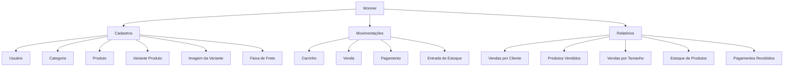
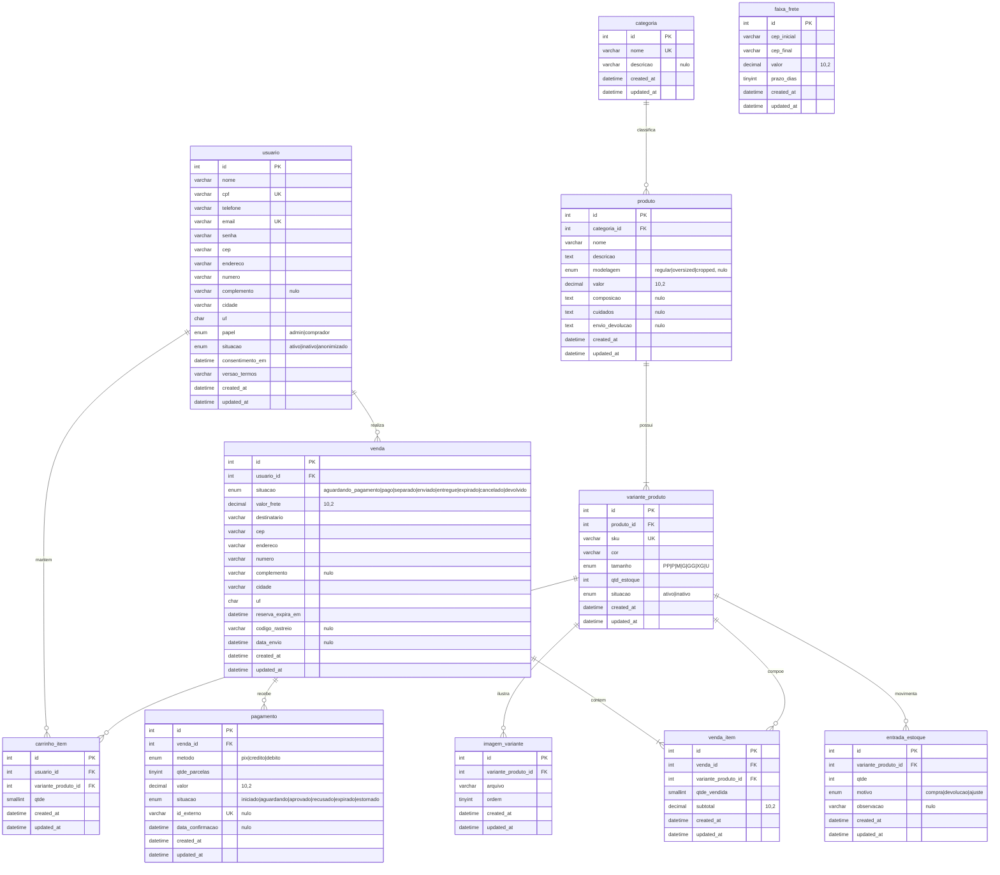

<!--
CÓPIA DE TRABALHO do documento do TCC, transcrita do PDF
"TCC - Projeto Wonner - Google Docs.pdf".

Regra: este arquivo é a VERSÃO CORRENTE do documento. Toda decisão registrada em
DECISOES.md é aplicada aqui no mesmo momento. O PDF/Google Docs é gerado a partir
daqui, nunca o contrário.

Marcações no texto:
  <!-- PENDENCIA: RQ-nn --> aponta o trecho afetado por uma pendência aberta.
  Ao resolver, o texto é corrigido e a marcação apagada.

A seção "Estado do documento" logo abaixo é de trabalho: apagar antes de exportar.
-->

# Projeto Integrador — Wonner.com

**Instituto Federal do Paraná — Umuarama, 2024**

Igor M. Delmonaco
Felipe T. Rodrigues

---

<!-- ═══ SEÇÃO DE TRABALHO — APAGAR ANTES DE EXPORTAR ═══ -->

## Estado do documento

Decisões aplicadas: `D-01` a `D-30` (ver [DECISOES.md](DECISOES.md)).

| Seção | Situação |
|---|---|
| 1.1 – 1.5 | ✅ **Completa** — RF001 a RF016, NF001 a NF004, regras de negócio |
| 2.1 Diagrama geral | ✅ Especificada · imagem a substituir (`DG-01`) |
| 2.2 Casos de uso | ⚠️ Texto escrito, **diagrama ausente** |
| 2.3 Diagrama de classes | ✅ Especificada · imagem a substituir (`DG-01`) |
| 2.4 Modelo relacional | ✅ Especificada · imagem a substituir (`DG-01`) |
| 3 Interfaces | ❌ Só o título — nada escrito |
| 4.1 Protótipo | ❌ Nada escrito |
| 4.2 Script DDL | ✅ Escrito · **não executado** contra um MySQL ainda |
| 4.3 Script DML | ❌ Nada escrito — é também a carga de demonstração |
| 4.4 Consultas dos relatórios | ❌ Nada escrito — cinco consultas (ver D-17) |
| 5 Referências | ❌ Citações usadas no texto (Visure Solutions, Castro 2016, Brito 2010, Clemente 2024, Ramos 2013, Braz Junior 2007, Araújo 2008) mas a lista não existe |

<!-- ═══ FIM DA SEÇÃO DE TRABALHO ═══ -->

---

## Sumário

1. [Identificação, situação e requisitos](#11-identificação-do-sistema)
   - [1.1 Identificação do sistema](#11-identificação-do-sistema)
   - [1.2 Situação atual](#12-situação-atual)
   - [1.3 Proposta de sistema](#13-proposta-de-sistema)
   - [1.4 Documento de requisitos do sistema](#14-documento-de-requisitos-do-sistema)
     - [1.4.1 Requisitos funcionais](#141-requisitos-funcionais)
     - [1.4.2 Requisitos não funcionais](#142-requisitos-não-funcionais)
     - [1.4.3 Funções do sistema](#143-funções-do-sistema)
   - [1.5 Regras de negócio](#15-regras-de-negócio)
2. [Descrição/modelagem de dados do sistema](#2-descriçãomodelagem-de-dados-do-sistema)
   - [2.1 Diagrama geral do sistema](#21-diagrama-geral-do-sistema)
   - [2.2 Diagrama de casos de uso](#22-diagrama-de-casos-de-uso)
   - [2.3 Diagrama de classes](#23-diagrama-de-classes)
   - [2.4 Diagrama do modelo relacional](#24-diagrama-do-modelo-relacional)
3. [Interfaces](#3-interfaces)
4. [Implementação do sistema](#4-implementação-do-sistema)
5. [Referências](#5-referências)

---

## 1.1 IDENTIFICAÇÃO DO SISTEMA

A Wonner é uma empresa de e-commerce de roupas em fase inicial de desenvolvimento.
O negócio encontra-se em processo de estruturação, com foco na criação de sua
presença digital e na construção de uma base inicial de clientes.

## 1.2 SITUAÇÃO ATUAL

Atualmente, a empresa está concentrada no desenvolvimento de sua plataforma de vendas
online, que será responsável por gerenciar o catálogo de produtos e realizar o
processamento de pedidos. Paralelamente ao desenvolvimento do sistema, a Wonner
também trabalha na definição de sua identidade de marca, estratégias de marketing
digital e estrutura logística para atendimento dos pedidos.

Por ser uma empresa nova no mercado, um dos principais desafios da Wonner é conquistar
visibilidade e credibilidade junto ao público. Para isso, a organização busca utilizar
canais digitais, como redes sociais e campanhas online, como principais meios de
divulgação e aquisição de clientes.

## 1.3 PROPOSTA DE SISTEMA

Nesse momento, as prioridades da empresa estão voltadas para:

- desenvolvimento e implementação do sistema de e-commerce
- cadastro inicial de produtos e organização do catálogo
- definição de processos de venda e entrega
- construção de presença digital e captação dos primeiros clientes

Dessa forma, a Wonner encontra-se em uma fase estratégica de consolidação, onde o
desenvolvimento tecnológico do sistema e a validação do modelo de negócio são fatores
essenciais para o crescimento da empresa.

## 1.4 DOCUMENTO DE REQUISITOS DO SISTEMA

Para Visure Solutions, um documento de requisitos do sistema é um documento detalhado
que descreve todas as necessidades e funcionalidades que um sistema deve atender para
cumprir seus objetivos. Ele serve como uma referência principal para o desenvolvimento
e implementação do sistema, descrevendo o que o sistema deve fazer, além de especificar
restrições, critérios de desempenho e condições de funcionamento.

Para estabelecer prioridade dos requisitos, nas seções 1.4.1 e 1.4.2, foram adotadas as
denominações "essencial", "importante" e "desejável".

- **Essencial** > requisito sem o qual o sistema não entra em funcionamento.
- **Importante** > requisito sem o qual o sistema entra em funcionamento, porém de modo
  não satisfatório.
- **Desejável** > requisito que não compromete as funcionalidades básicas do sistema, o
  sistema pode funcionar de forma satisfatória sem ele e pode ser implementado em
  versões posteriores.

### 1.4.1 Requisitos funcionais

Para Castro (2016), os requisitos funcionais detalham as funcionalidades que o sistema
precisa oferecer. A seguir, estão listados os requisitos funcionais identificados ao
longo do processo de licitação. Cada requisito inclui um código identificador, nome,
descrição, prioridade e o caso de uso associado.

#### 1.4.1.1 [RF001] Cadastro e autenticação

prioridade: Essencial.

O sistema deve permitir a realização do auto-cadastro do usuário, captando as
informações essenciais para identificação e responsabilização do usuário pela compra.

Disponibilizando o devido acesso do usuário, seguro e privado, aos seus respectivos
dados.


#### 1.4.1.2 [RF002] Calcular valores de produtos selecionados

prioridade: Essencial.

O sistema deve apresentar ao pedido de compra todos os dados essenciais dos produtos
selecionados.

#### 1.4.1.3 [RF003] Inserir itens ao carrinho

prioridade: Essencial.

O sistema deve proporcionar ao cliente adicionar uma ou várias variantes de produto ao
seu carrinho, informando a quantidade desejada de cada uma.

O carrinho é **persistente e pertence ao usuário**: seu conteúdo permanece disponível
entre sessões, por tempo indeterminado. Um item deixa o carrinho em apenas duas
situações: quando a compra correspondente é confirmada, ou quando o próprio cliente o
remove.

O carrinho apresenta a disponibilidade e o preço vigente de cada variante, porém **não
reserva estoque e não congela preço** — ambos ocorrem apenas no checkout (RF004). A
expiração ou o cancelamento de um pedido não afetam o carrinho.

#### 1.4.1.4 [RF004] Realizar compra

prioridade: Essencial.

Quando o cliente confirmar a compra, ele será direcionado para uma tela de pagamento,
na qual será realizado o recebimento do valor total dos produtos inseridos no carrinho
e das cobranças de frete.

A tela de pagamento permite ao usuário selecionar os métodos: PIX e cartão de
crédito/débito.

Ao iniciar o checkout, o sistema deve criar o pedido a partir de uma cópia dos itens do
carrinho e **reservar** a quantidade correspondente pelo prazo de **15 minutos**,
tornando-a indisponível aos demais clientes durante esse período. O prazo restante deve
ser exibido ao cliente.

O valor do frete deve ser obtido a partir do cadastro de faixas de CEP, considerando o
CEP de entrega informado, e congelado no pedido no momento do fechamento.

O pedido somente avança para o estado "pago" **após a confirmação do pagamento pelo
provedor**, nunca no momento em que o cliente submete os dados. Enquanto a confirmação
não ocorre, o pedido permanece no estado "aguardando pagamento".

Quando o método selecionado for cartão de crédito, o sistema deve permitir o
parcelamento conforme a regra de negócio correspondente, apresentando ao cliente apenas
as quantidades de parcelas admitidas para o valor do pedido.

#### 1.4.1.5 [RF005] Buscar produto

prioridade: Importante.

O sistema deve proporcionar ao cliente buscar produtos por seus atributos (nome, cor,
categoria, modelagem, descrição).


#### 1.4.1.6 [RF006] Classificar produtos

prioridade: Desejável.

Ao apresentar os "cards" de produto o sistema deve ordená-los de acordo com o critério
selecionado pelo usuário.

#### 1.4.1.7 [RF007] Apresentar catálogo de produto

prioridade: Importante.

O sistema deve apresentar os "cards" de produto na tela inicial por intersecções de
produtos com categorias semelhantes pré-definidas.


#### 1.4.1.8 [RF008] Confirmar pagamento

prioridade: Essencial.

O sistema deve receber e processar a confirmação de pagamento enviada pelo provedor,
registrando a data e hora da confirmação, dando baixa definitiva no estoque reservado e
promovendo o pedido ao estado "pago".

O processamento deve ser **idempotente**: a mesma confirmação, recebida mais de uma vez,
não pode produzir baixa de estoque duplicada nem alterar o pedido mais de uma vez.

Cobranças não confirmadas dentro do prazo de validade devem ser marcadas como expiradas,
liberando a reserva de estoque correspondente.

#### 1.4.1.9 [RF009] Manter faixas de frete

prioridade: Essencial.

O sistema deve permitir ao administrador cadastrar, alterar, excluir e pesquisar faixas
de CEP com o respectivo valor de frete e prazo de entrega estimado.

#### 1.4.1.10 [RF010] Apresentar detalhe do produto

prioridade: Essencial.

O sistema deve apresentar a página do produto contendo a galeria de imagens da variante
selecionada, nome, preço, descrição, composição, cuidados, política de envio e devolução,
seleção de cor e tamanho, quantidade disponível e produtos da mesma categoria.

Variantes sem disponibilidade devem ser apresentadas **riscadas** — visíveis, porém não
selecionáveis —, de modo que o cliente identifique a existência da variante e a
indisponibilidade momentânea.

#### 1.4.1.11 [RF011] Consultar pedidos

prioridade: Essencial.

O sistema deve apresentar ao cliente autenticado a relação de seus pedidos com o
respectivo estado, em ordem decrescente de data. Havendo código de rastreio registrado,
ele deve ser exibido junto ao estado do pedido.

#### 1.4.1.12 [RF012] Gerenciar cadastros

prioridade: Essencial.

O sistema deve permitir ao administrador cadastrar, salvar, alterar, cancelar, excluir e
pesquisar os cadastros de categoria, produto, variante de produto, imagens de variante,
faixas de frete e usuários, conforme as funções descritas na seção 1.4.3.

#### 1.4.1.13 [RF013] Processar pedido

prioridade: Essencial.

O sistema deve apresentar ao administrador os pedidos pagos e permitir o avanço do
respectivo estado ao longo do fluxo de expedição: **separado**, **enviado** e
**entregue**.

O avanço para o estado "enviado" exige o registro do código de rastreio, e a data do
envio deve ser gravada automaticamente.

O sistema deve permitir ainda o registro das ocorrências de **cancelamento** — antes do
envio — e de **devolução** — após o envio —, solicitadas pelo cliente por canal de
atendimento.

O administrador não pode alterar itens, quantidades, preços, frete ou valores de pedido
finalizado — apenas avançar o estado e registrar os dados de expedição e ocorrências.

#### 1.4.1.14 [RF014] Recuperar senha

prioridade: Desejável.

O sistema deve permitir ao usuário solicitar a redefinição de sua senha informando o
e-mail cadastrado, recebendo por e-mail um link de uso único e prazo de validade
limitado.

Enquanto este requisito não estiver implementado, o usuário que perder a senha perde o
acesso à conta: a senha é armazenada de forma irreversível e não há outro meio de
restabelecer o acesso.

#### 1.4.1.15 [RF015] Notificar o cliente por e-mail

prioridade: Desejável.

O sistema deve enviar e-mail ao cliente na confirmação do pagamento, contendo os dados
do pedido, e no envio do pedido, contendo o código de rastreio.

O envio das mensagens deve ocorrer de forma assíncrona, de modo que uma falha no serviço
de e-mail não impeça a confirmação do pedido.

#### 1.4.1.16 [RF016] Registrar entrada de estoque

prioridade: Essencial.

O sistema deve permitir ao administrador registrar entradas de estoque, informando a
variante, a quantidade, o motivo (compra, devolução ou ajuste) e observação opcional.

A tela deve permitir o registro de **várias variantes do mesmo produto em uma única
submissão**, informando a quantidade de cada tamanho, gerando um registro de entrada por
variante com quantidade informada.

Cada registro de entrada atualiza a quantidade em estoque da respectiva variante.


### 1.4.2 Requisitos não funcionais

Para Brito (2010), os requisitos não-funcionais representam os atributos de qualidade
que o sistema deve ter ou especificam o desempenho esperado para certas funções.
Elicitados paralelamente aos requisitos funcionais, eles impactam diretamente a
qualidade do sistema.

#### 1.4.2.1 [NF001] Interface

prioridade: Importante.

O sistema deve proporcionar interfaces estilizadas de acordo com o design da empresa,
responsivas e intuitivas ao usuário.

As tecnologias utilizadas para cumprir este requisito serão: TailWind CSS e DaisyUI
para estilização eficiente, e AlpineJs para reatividade.

#### 1.4.2.2 [NF002] Banco de dados

prioridade: Essencial.

O sistema deve implementar um banco de dados gratuito, que permita o estabelecimento de
um histórico íntegro.


#### 1.4.2.3 [NF003] Escalabilidade

prioridade: Importante.

O sistema deve proporcionar uma arquitetura capaz de suportar o uso simultâneo de todos
os clientes da marca, com margem para crescimento.

#### 1.4.2.4 [NF004] Tempo de resposta

prioridade: Importante.

O sistema deve ter uma latência de no máximo 2 segundos.

### 1.4.3 Funções do sistema

Para todos os módulos do sistema, serão necessárias as seguintes funções/métodos:

- **CADASTRAR** → possibilita a inserção de um novo cadastro no sistema verificando não
  duplicidade
- **SALVAR** → insere o novo registro do cadastro no banco de dados
- **ALTERAR** → possibilita alteração de dados já cadastrados no sistema
- **CANCELAR** → cancela a edição de um cadastro atual
- **EXCLUIR** → exclui um cadastro do sistema, desde que este não tenha nenhum
  relacionamento
- **PESQUISAR** → busca um cadastro existente no sistema e mostra os dados na tela

Para organizar e sistematizar os requisitos do sistema, serão necessários cadastros,
movimentações e relatórios.

Adotaremos a legenda abaixo para organizar os atributos dos cadastros e movimentações:

| Símbolo | Significado |
|---|---|
| `@` | atributo inserido automaticamente |
| `#` | atributo validado |
| `*` | atributo obrigatório (não pode ser nulo) |
| `**` | atributo calculado |

Adotaremos também uma lista de abreviaturas que serão descritas no decorrer do
documento de requisitos:

| Sigla | Significado |
|---|---|
| BD | banco de dados |
| CEP | código de endereçamento postal |
| CNPJ | cadastro nacional de pessoa jurídica |
| CPF | cadastro de pessoa física |
| DN | data nascimento |
| HW | hardware |
| QUANT | quantidade |
| RG | registro geral (identidade) |
| SW | software |

#### A) CADASTROS

Os cadastros são os dados que irão alimentar o sistema a fim de registrar informações
inerentes ao funcionamento do estabelecimento.

1. **Usuário:** `@*código`, `*nome`, `*#CPF`, `*#telefone`, `*endereco`, `*numero`,
   `complemento`, `*cidade`, `*uf`, `*#cep`, `*papel`, `*situacao`, `*email`, `*#senha`,
   `@*consentimentoEm`, `@*versaoTermos`
2. **Categoria:** `@*código`, `*nome`, `*descrição`
3. **Produto:** `@*código`, `*nome`, `*descrição`, `*@codCategoria`, `modelagem`,
   `*valor`, `composição`, `cuidados`, `envioDevolucao`
4. **Variante Produto:** `@*código`, `*#sku`, `*cor`, `*tamanho`, `*situacao`,
   `*qtdEstoque`
5. **Imagem da Variante:** `@*código`, `*@codVarianteProd`, `*arquivo`, `*ordem`
6. **Faixa de Frete:** `@*código`, `*cepInicial`, `*cepFinal`, `*valor`, `*prazoDias`

A **categoria** classifica o tipo de peça (Camisetas, Moletons, Acessórios) e é exclusiva:
um produto pertence a uma categoria, e uma categoria reúne vários produtos. A
**modelagem** descreve o corte da peça (regular, oversized, cropped) e é independente da
categoria, podendo repetir-se entre categorias distintas — razão pela qual não constitui
subcategoria. Não há hierarquia de categorias.


#### B) MOVIMENTAÇÕES

As movimentações são:

1. **Item de Carrinho:** `@*código`, `*@codUsuario`, `*@codVarianteProd`, `*qtde`
2. **Venda:** `@*código`, `*@codUsuario`, `*situacao`, `***frete`, `***valorTotal`,
   `codigoRastreio`, `@dataEnvio`, `*destinatario`, `*cep`, `*endereco`, `*numero`,
   `complemento`, `*cidade`, `*uf`
3. **Item de Venda:** `@*código`, `*@codVenda`, `*@codVarianteProd`, `*qtdeVendida`,
   `***subTotal`
4. **Pagamento:** `@*código`, `*@codVenda`, `*metodo`, `*qtdeParcelas`, `*valor`,
   `*situacao`, `#idExterno`, `dataConfirmacao`
5. **Entrada de Estoque:** `@*código`, `*@codVarianteProd`, `*qtde`, `*motivo`,
   `observacao`

Os dados de entrega são copiados para a venda no fechamento do pedido, de modo que
alterações posteriores no cadastro do usuário não alterem pedidos já realizados — mesmo
princípio adotado para o subtotal dos itens.

A data da venda corresponde à data de criação do registro, e a quantidade total de peças e
o valor total do pedido são obtidos a partir dos itens, não armazenados na venda.

Cada **entrada de estoque** registra um evento por variante, com a respectiva quantidade;
não há um registro por unidade física.

Uma venda possui um ou mais pagamentos, um por tentativa de cobrança: uma cobrança
recusada ou expirada permanece registrada e o cliente pode iniciar outra.


#### C) RELATÓRIOS (dashboard)

Os relatórios são a junção de dados e informações de maneira organizada para serem
apresentadas de maneira rápida e organizada de modo a auxiliar em tomada de decisão do
usuário do sistema ou de outro encarregado (gerente da empresa).

| Relatório | Agrupa por | Exibe | Serve para |
|---|---|---|---|
| **Vendas por Cliente** | usuário | nº de pedidos, valor total, ticket médio, data do último pedido | identificar quem mais compra |
| **Produtos Vendidos** | produto, detalhando variante | quantidade vendida, receita | saber o que mais vende |
| **Vendas por Tamanho** | tamanho da variante | quantidade vendida, participação percentual | dimensionar a próxima produção |
| **Estoque de Produtos** | variante | quantidade em estoque, reservada e disponível | repor antes de esgotar |
| **Pagamentos Recebidos** | período, método e nº de parcelas | valor confirmado | acompanhar a entrada de caixa |

Duas regras valem para todos os relatórios:

1. Somente pedidos efetivamente pagos são considerados nos relatórios de venda — pedidos
   nas situações `aguardando_pagamento`, `expirado` e `cancelado` são excluídos;
2. Os valores apresentados são os congelados no pedido, não os do cadastro corrente, de
   modo que reajustes de preço não alterem resultados de períodos anteriores.

## 1.5 REGRAS DE NEGÓCIO

Para Clemente (2024), regras de negócio são instruções precisas que definem, controlam,
ou influenciam o comportamento operacional de um sistema. Elas refletem as políticas,
procedimentos, e condições essenciais para que a organização atinja seus objetivos,
garantindo consistência, eficiência e conformidade das operações.

Para este sistema, serão definidas as seguintes regras de negócio abaixo:

- É exigido ao cliente um cadastro de CPF para realizar uma compra;
- O usuário pode comprar diversos produtos em uma venda;
- **LGPD obrigatória:** o cliente deve marcar um checkbox de consentimento de termos de
  uso antes de finalizar o cadastro, registrando-se a data, a hora e a versão dos termos
  aceitos;
- O nível de acesso do usuário é determinado pelo seu **papel** (Admin ou Comprador),
  atributo distinto de sua **situação** (ativo ou inativo): um administrador inativo não
  acessa o sistema, e um comprador inativo não realiza compras;
- **Histórico inalterável:** o histórico de pedidos finalizados não pode ser apagado ou
  editado pelo cliente. Ao administrador é permitido apenas avançar o estado do pedido e
  registrar dados de expedição (código de rastreio e datas); itens, quantidades, preços,
  frete e valores são imutáveis para todos os perfis. **Ressalva:** atendido pedido legal
  de eliminação de dados pessoais (art. 18 da LGPD), o cadastro do usuário é anonimizado —
  nome, CPF, e-mail, telefone e endereço são substituídos por valores sem identificação —,
  preservando-se os pedidos, valores e datas. A conta anonimizada não pode ser reativada.
  Ficam retidos, pelo prazo legal aplicável, os dados cuja conservação seja exigida por
  obrigação legal ou necessária ao exercício de direitos em processo judicial,
  administrativo ou arbitral;
- O pagamento poderá ser realizado tanto a vista quanto à prazo (crédito);

**Carrinho**

- O carrinho pertence ao usuário e não expira;
- Um item sai do carrinho apenas quando a compra é confirmada ou quando o cliente o
  remove; a expiração ou o cancelamento de um pedido não afetam o carrinho;
- A mesma variante não se duplica no carrinho: a quantidade é somada;
- O carrinho exibe o preço vigente, sem garantia de manutenção de valor.

**Estoque e reserva**

- A reserva de estoque ocorre no início do checkout, não ao adicionar o item ao carrinho;
- O prazo de reserva é de 15 minutos, exibido ao cliente durante o checkout;
- Uma variante só pode ser adicionada ao checkout se a quantidade disponível
  (estoque menos reservas vigentes) for suficiente;
- A baixa definitiva no estoque ocorre na confirmação do pagamento;
- O término do prazo de reserva sem confirmação, ou o cancelamento do pedido, libera a
  quantidade reservada.

**Pagamento**

- O pedido só é considerado pago após a confirmação do provedor de pagamento; a submissão
  dos dados pelo cliente não caracteriza pagamento;
- O prazo de validade da cobrança é o mesmo prazo da reserva de estoque;
- Uma venda pode ter mais de uma tentativa de pagamento; tentativas recusadas ou
  expiradas permanecem registradas;
- O parcelamento é admitido **exclusivamente** no cartão de crédito; PIX e cartão de
  débito são sempre cobrados em uma única parcela;
- O parcelamento é **sem juros** — o valor cobrado do cliente é igual ao valor do pedido;
- A quantidade máxima de parcelas é limitada a 6 e ao valor mínimo de R$ 50,00 por
  parcela, prevalecendo o menor dos dois limites.

**Estados do pedido**

- O pedido percorre os estados: `aguardando_pagamento` → `pago` → `separado` → `enviado`
  → `entregue`;
- A partir de `aguardando_pagamento`, o pedido pode ir para `expirado` (fim do prazo de
  reserva) ou `cancelado`;
- A passagem para `pago` é automática, na confirmação do pagamento; as demais são ações
  do administrador;
- A passagem para `enviado` exige o registro do código de rastreio.

**Arrependimento e devolução**

- Em conformidade com o art. 49 do Código de Defesa do Consumidor, o cliente pode desistir
  da compra em até **7 dias corridos** contados do recebimento do produto;
- A solicitação é feita por canal de atendimento e registrada no sistema pelo
  administrador: `cancelado` quando o pedido ainda não foi enviado, `devolvido` quando já
  havia sido;
- O cancelamento de pedido ainda não pago libera a reserva de estoque;
- O estorno do valor é realizado junto ao provedor de pagamento, cabendo ao sistema
  registrar a situação `estornado` do respectivo pagamento;
- A reentrada do item devolvido em estoque é decidida pelo administrador e registrada como
  entrada, pois peça devolvida pode não estar em condição de revenda.

**Entrega**

- O valor do frete é determinado pela faixa de CEP correspondente ao endereço de entrega;
- O valor do frete é congelado no pedido no momento do fechamento, não sendo afetado por
  alterações posteriores na tabela de faixas.


---

# 2 DESCRIÇÃO/MODELAGEM DE DADOS DO SISTEMA

A Modelagem de Sistemas de Informação trata-se da atividade de desenvolver modelos
(diagramas) que façam a representação dos sistemas sob diferentes perspectivas,
facilitando assim o entendimento do que o sistema irá fornecer e gerenciar
(funcionalidades), de como o sistema se comunicará com outros sistemas e/ou usuários,
dentre outras visões. Utiliza-se uma linguagem de modelagem unificada (UML — Unified
Modeling Language), que possibilita a notação padronizada para modelar e documentar as
diversas fases do desenvolvimento de sistemas orientados a objeto, além de padronizar
também a comunicação e a organização do problema a ser resolvido.

## 2.1 DIAGRAMA GERAL DO SISTEMA

O diagrama geral do sistema denota os módulos que o produto de software irá ter.
Geralmente dividido em cadastros, movimentações e relatórios, pois assim facilita a
visualização e o entendimento das funcionalidades do sistema.





## 2.2 DIAGRAMA DE CASOS DE USO

Segundo Ramos (2013), um diagrama de casos de uso ilustra a interação entre os atores
(usuários ou outros sistemas) e os casos de uso (funcionalidades) de um sistema
específico. Este diagrama oferece uma visão geral e de alto nível do sistema, sendo
crucial estabelecer corretamente suas fronteiras.

> **⚠️ Diagrama ausente.** A seção 1.4.1 afirma que cada requisito "inclui [...] o caso
> de uso associado", mas nenhum RF cita o caso de uso e o diagrama não existe no
> documento.

## 2.3 DIAGRAMA DE CLASSES

Segundo Braz Junior (2007), um diagrama de classes é um dos principais componentes da
UML (Linguagem de Modelagem Unificada) e representa a estrutura estática de um sistema.
Ele descreve as classes que compõem o sistema, os atributos e métodos dessas classes, e
os relacionamentos entre elas. Sendo considerado estático, o diagrama de classes mantém
sua validade durante todo o ciclo de vida do sistema, independentemente de alterações
dinâmicas que possam ocorrer em tempo de execução. A notação utilizada nesse tipo de
diagrama é baseada em conceitos de Diagramas Entidade-Relacionamento e no Modelo de
Objetos de OMT, consolidando-se como uma ferramenta essencial no desenvolvimento
orientado a objetos.


### 2.3.1 Classes, atributos, operações e multiplicidades

Atributos de cada classe, com visibilidade privada. Os atributos de auditoria
(`criadoEm`, `alteradoEm`), presentes em todas as relações do modelo relacional, são
omitidos do diagrama de classes por serem infraestrutura, não regra de negócio.

| Classe | Atributos |
|---|---|
| **Usuario** | `nome : String` · `cpf : String` · `telefone : String` · `email : String` · `senha : String` · `cep : String` · `endereco : String` · `numero : String` · `complemento : String` · `cidade : String` · `uf : String` · `papel : Papel` · `situacao : SituacaoUsuario` · `consentimentoEm : DateTime` · `versaoTermos : String` |
| **Categoria** | `nome : String` · `descricao : String` |
| **Produto** | `nome : String` · `descricao : String` · `modelagem : Modelagem` · `valor : Decimal` · `composicao : String` · `cuidados : String` · `envioDevolucao : String` |
| **VarianteProduto** | `sku : String` · `cor : String` · `tamanho : Tamanho` · `qtdEstoque : int` · `situacao : SituacaoVariante` |
| **ImagemVariante** | `arquivo : String` · `ordem : int` |
| **FaixaFrete** | `cepInicial : String` · `cepFinal : String` · `valor : Decimal` · `prazoDias : int` |
| **CarrinhoItem** | `qtde : int` |
| **Venda** | `situacao : SituacaoVenda` · `valorFrete : Decimal` · `destinatario : String` · `cep : String` · `endereco : String` · `numero : String` · `complemento : String` · `cidade : String` · `uf : String` · `reservaExpiraEm : DateTime` · `codigoRastreio : String` · `dataEnvio : DateTime` |
| **VendaItem** | `qtdeVendida : int` · `subTotal : Decimal` |
| **Pagamento** | `metodo : MetodoPagamento` · `qtdeParcelas : int` · `valor : Decimal` · `situacao : SituacaoPagamento` · `idExterno : String` · `dataConfirmacao : DateTime` |
| **EntradaEstoque** | `qtde : int` · `motivo : MotivoEntrada` |

**Enumerações**

| Tipo | Valores |
|---|---|
| `Papel` | `admin`, `comprador` |
| `SituacaoUsuario` | `ativo`, `inativo`, `anonimizado` |
| `Modelagem` | `regular`, `oversized`, `cropped` |
| `Tamanho` | `PP`, `P`, `M`, `G`, `GG`, `XG`, `U` |
| `SituacaoVariante` | `ativo`, `inativo` |
| `SituacaoVenda` | `aguardando_pagamento`, `pago`, `separado`, `enviado`, `entregue`, `expirado`, `cancelado`, `devolvido` |
| `MetodoPagamento` | `pix`, `credito`, `debito` |
| `SituacaoPagamento` | `iniciado`, `aguardando`, `aprovado`, `recusado`, `expirado`, `estornado` |
| `MotivoEntrada` | `compra`, `devolucao`, `ajuste` |

`VendaItem` e `CarrinhoItem` são **classes associativas**: a primeira qualifica a
associação entre Venda e VarianteProduto, registrando a quantidade e o subtotal congelado;
a segunda qualifica a associação entre Usuario e VarianteProduto, registrando a quantidade
pretendida.

Todas as classes de cadastro implementam as operações previstas na seção 1.4.3 —
`cadastrar()`, `salvar()`, `alterar()`, `cancelar()`, `excluir()` e `pesquisar()`. A tabela
abaixo relaciona apenas as operações **próprias** de cada classe, que expressam suas regras
de negócio.

| Classe | Operações próprias |
|---|---|
| Usuario | `autenticar()`, `redefinirSenha()`, `anonimizar()` |
| Categoria | — |
| Produto | `precoFormatado()` |
| VarianteProduto | `disponivel()`, `quantidadeDisponivel()`, `baixarEstoque()`, `reporEstoque()` |
| ImagemVariante | — |
| FaixaFrete | `calcularPara(cep)` |
| CarrinhoItem | `incluir()`, `alterarQuantidade()`, `remover()` |
| Venda | `abrirCheckout()`, `calcularTotal()`, `reservarEstoque()`, `liberarReserva()`, `avancarSituacao()`, `registrarEnvio()`, `cancelar()`, `devolver()` |
| VendaItem | `calcularSubtotal()` |
| Pagamento | `iniciarCobranca()`, `confirmar()`, `recusar()`, `expirar()`, `estornar()`, `parcelasPermitidas()` |
| EntradaEstoque | `registrar()` |

Multiplicidades:

| Origem | Multiplicidade | Destino |
|---|---|---|
| Categoria | 1 ── 0..* | Produto |
| Produto | 1 ── 1..* | VarianteProduto |
| VarianteProduto | 1 ── 0..* | ImagemVariante |
| VarianteProduto | 1 ── 0..* | EntradaEstoque |
| Usuario | 1 ── 0..* | CarrinhoItem |
| Usuario | 1 ── 0..* | Venda |
| Venda | 1 ── 1..* | VendaItem |
| Venda | 1 ── 0..* | Pagamento |
| VarianteProduto | 1 ── 0..* | CarrinhoItem |
| VarianteProduto | 1 ── 0..* | VendaItem |

A multiplicidade `1..*` entre Produto e VarianteProduto expressa que um produto sem
variante não é vendável. Já Categoria admite `0..*` produtos, de modo que uma categoria
possa ser cadastrada antes de existir produto nela. `Venda 1 ── 1..* VendaItem` decorre de
o pedido nascer de uma cópia dos itens do carrinho, nunca vazio.

     qteParcelas:int divergem dos tipos do modelo relacional -->

## 2.4 DIAGRAMA DO MODELO RELACIONAL

Segundo Araújo (2008), o Modelo Relacional (MR) é a ferramenta que traduz a solução do
problema modelado em estruturas de dados (relações), as quais, no processo de
implementação do banco de dados, se tornam tabelas.


Convenções adotadas na implementação do modelo:

| Aspecto | Convenção |
|---|---|
| Nomes de tabela | `snake_case`, no singular |
| Chave primária | `id` |
| Chave estrangeira | `<entidade>_id` |
| Valores monetários | `DECIMAL(10,2)` |
| Atributos de estado | lista fechada de valores, nunca texto livre |
| Tamanho da variante | lista fechada: `PP`, `P`, `M`, `G`, `GG`, `XG`, `U` |
| Datas e horas | `DATETIME`, com `created_at` e `updated_at` em todas as tabelas |

O uso de `DECIMAL` para valores monetários decorre de `DOUBLE` ser um tipo de ponto
flutuante binário conforme a norma IEEE 754, no qual valores como 0,10 não possuem
representação exata — o que faz somas sucessivas de centavos acumularem erro.

### 2.4.1 Especificação das relações



**Restrições de unicidade**

| Relação | Colunas | Finalidade |
|---|---|---|
| usuario | `cpf` | chave de negócio: a regra exige CPF para comprar |
| usuario | `email` | credencial de acesso |
| categoria | `nome` | evita categorias homônimas |
| variante_produto | `sku` | o código operacional identifica uma variante só |
| variante_produto | (`produto_id`, `cor`, `tamanho`) | impede duplicar a mesma combinação |
| carrinho_item | (`usuario_id`, `variante_produto_id`) | a variante não se repete no carrinho |
| venda_item | (`venda_id`, `variante_produto_id`) | a variante não se repete no pedido |
| pagamento | `id_externo` | garante o processamento único da confirmação |

**Regras que o modelo não representa graficamente**

As regras abaixo integram o modelo, ainda que não sejam legíveis no diagrama. Parte delas é
garantida pelo próprio esquema, por meio de restrições `CHECK` — a relação completa está na
seção 4.2.1; as demais dependem de mais de um registro ou de comportamento transacional e
ficam a cargo da aplicação.

1. `pagamento.qtde_parcelas` só pode ser maior que 1 quando `metodo = 'credito'`;
   PIX e débito são sempre uma parcela.
2. O número máximo de parcelas é o menor entre 6 e o resultado da divisão do valor do
   pedido por R$ 50,00.
3. As faixas de CEP em `faixa_frete` não podem se sobrepor — a verificação ocorre no
   cadastro, pois não é expressável como restrição de integridade.
4. `entrada_estoque.qtde` admite valor negativo apenas quando `motivo = 'ajuste'`,
   caso de correção de contagem.
5. A quantidade disponível de uma variante é `qtd_estoque` menos a soma das quantidades
   dos itens de vendas em `aguardando_pagamento` cuja reserva ainda não expirou.
6. `venda.reserva_expira_em` é preenchida na criação do pedido com quinze minutos à frente;
   vencido o prazo sem confirmação de pagamento, a venda passa a `expirado`.
7. A transição para `venda.situacao = 'enviado'` exige `codigo_rastreio` preenchido.
8. Na confirmação do pagamento, a baixa em `qtd_estoque` e a mudança de situação da venda
   devem ocorrer na mesma transação. Como a quantidade disponível é calculada descontando
   as vendas pendentes, executar apenas uma das duas operações faz a disponibilidade
   aumentar ou diminuir indevidamente.
9. O cliente pode ter no máximo uma venda em `aguardando_pagamento`; ao iniciar novo
   checkout, a anterior é cancelada na mesma transação em que a nova é criada.
10. A verificação de disponibilidade e a criação do pedido devem ocorrer sob bloqueio da
    variante, de modo que dois clientes concorrentes não reservem a mesma unidade. Sem o
    bloqueio, ambos leem a mesma quantidade disponível e a reserva torna-se ineficaz
    justamente sob concorrência, que é quando ela é necessária.
11. Toda quantidade apresentada ao cliente — inclusive avisos de estoque baixo — é a
    quantidade **disponível**, nunca `qtd_estoque`, que desconsidera as reservas vigentes.

**Índices recomendados além das chaves e restrições**

`venda(usuario_id, created_at)` para a consulta de pedidos do cliente ·
`venda(situacao, reserva_expira_em)` para a rotina de expiração ·
`venda_item(variante_produto_id)` para os relatórios de produtos e tamanhos ·
`produto(categoria_id)` para a navegação do catálogo.


---

# 3 Interfaces

## 3.1 Interfaces de Vídeo

### 3.1.1 Cadastros

> **⚠️ Não escrita.**

### 3.1.2 Movimentações

> **⚠️ Não escrita.**

## 3.2 Interfaces Impressas

> **⚠️ Não escrita.** Cinco relatórios, conforme a seção 1.4.3-C:
> 3.2.1 Vendas por Cliente · 3.2.2 Produtos Vendidos · 3.2.3 Vendas por Tamanho ·
> 3.2.4 Estoque de Produtos · 3.2.5 Pagamentos Recebidos.

---

# 4 Implementação do Sistema

## 4.1 Protótipo do Sistema

> **⚠️ Não escrita.**

## 4.2 Script DDL

O script a seguir cria o esquema no MySQL 8, atendendo ao requisito NF002 quanto ao uso de
banco de dados gratuito. As tabelas são criadas na ordem de dependência, de modo que cada
chave estrangeira referencie uma tabela já existente.

O comportamento das chaves estrangeiras segue a regra da seção 1.4.3, segundo a qual a
exclusão só é permitida a registros sem relacionamento: adota-se `RESTRICT` como padrão. A
exceção são `imagem_variante` e `carrinho_item`, cujos registros não têm existência própria
apartada de quem os possui, e por isso acompanham a exclusão do registro-pai.

```sql
CREATE DATABASE IF NOT EXISTS wonner
    CHARACTER SET utf8mb4
    COLLATE utf8mb4_unicode_ci;

USE wonner;

-- ─────────────────────────────────────────────────────────────
-- CADASTROS
-- ─────────────────────────────────────────────────────────────

CREATE TABLE categoria (
    id          INT UNSIGNED NOT NULL AUTO_INCREMENT,
    nome        VARCHAR(45)  NOT NULL,
    descricao   VARCHAR(255) NULL,
    created_at  DATETIME     NOT NULL DEFAULT CURRENT_TIMESTAMP,
    updated_at  DATETIME     NOT NULL DEFAULT CURRENT_TIMESTAMP
                             ON UPDATE CURRENT_TIMESTAMP,
    PRIMARY KEY (id),
    UNIQUE KEY uk_categoria_nome (nome)
) ENGINE = InnoDB;

CREATE TABLE usuario (
    id                INT UNSIGNED NOT NULL AUTO_INCREMENT,
    nome              VARCHAR(100) NOT NULL,
    cpf               VARCHAR(11)  NOT NULL,
    telefone          VARCHAR(15)  NOT NULL,
    email             VARCHAR(100) NOT NULL,
    senha             VARCHAR(255) NOT NULL,
    cep               VARCHAR(8)   NOT NULL,
    endereco          VARCHAR(100) NOT NULL,
    numero            VARCHAR(10)  NOT NULL,
    complemento       VARCHAR(100) NULL,
    cidade            VARCHAR(45)  NOT NULL,
    uf                CHAR(2)      NOT NULL,
    papel             ENUM('admin', 'comprador')                   NOT NULL DEFAULT 'comprador',
    situacao          ENUM('ativo', 'inativo', 'anonimizado')      NOT NULL DEFAULT 'ativo',
    consentimento_em  DATETIME     NOT NULL,
    versao_termos     VARCHAR(20)  NOT NULL,
    created_at        DATETIME     NOT NULL DEFAULT CURRENT_TIMESTAMP,
    updated_at        DATETIME     NOT NULL DEFAULT CURRENT_TIMESTAMP
                                   ON UPDATE CURRENT_TIMESTAMP,
    PRIMARY KEY (id),
    UNIQUE KEY uk_usuario_cpf   (cpf),
    UNIQUE KEY uk_usuario_email (email)
) ENGINE = InnoDB;

CREATE TABLE produto (
    id               INT UNSIGNED  NOT NULL AUTO_INCREMENT,
    categoria_id     INT UNSIGNED  NOT NULL,
    nome             VARCHAR(100)  NOT NULL,
    descricao        TEXT          NOT NULL,
    modelagem        ENUM('regular', 'oversized', 'cropped') NULL,
    valor            DECIMAL(10,2) NOT NULL,
    composicao       TEXT          NULL,
    cuidados         TEXT          NULL,
    envio_devolucao  TEXT          NULL,
    created_at       DATETIME      NOT NULL DEFAULT CURRENT_TIMESTAMP,
    updated_at       DATETIME      NOT NULL DEFAULT CURRENT_TIMESTAMP
                                   ON UPDATE CURRENT_TIMESTAMP,
    PRIMARY KEY (id),
    KEY idx_produto_categoria (categoria_id),
    CONSTRAINT fk_produto_categoria
        FOREIGN KEY (categoria_id) REFERENCES categoria (id)
        ON DELETE RESTRICT ON UPDATE CASCADE,
    CONSTRAINT ck_produto_valor CHECK (valor >= 0)
) ENGINE = InnoDB;

CREATE TABLE variante_produto (
    id           INT UNSIGNED NOT NULL AUTO_INCREMENT,
    produto_id   INT UNSIGNED NOT NULL,
    sku          VARCHAR(30)  NOT NULL,
    cor          VARCHAR(45)  NOT NULL,
    tamanho      ENUM('PP', 'P', 'M', 'G', 'GG', 'XG', 'U') NOT NULL,
    qtd_estoque  INT          NOT NULL DEFAULT 0,
    situacao     ENUM('ativo', 'inativo')                   NOT NULL DEFAULT 'ativo',
    created_at   DATETIME     NOT NULL DEFAULT CURRENT_TIMESTAMP,
    updated_at   DATETIME     NOT NULL DEFAULT CURRENT_TIMESTAMP
                              ON UPDATE CURRENT_TIMESTAMP,
    PRIMARY KEY (id),
    UNIQUE KEY uk_variante_sku (sku),
    UNIQUE KEY uk_variante_combinacao (produto_id, cor, tamanho),
    CONSTRAINT fk_variante_produto
        FOREIGN KEY (produto_id) REFERENCES produto (id)
        ON DELETE RESTRICT ON UPDATE CASCADE,
    CONSTRAINT ck_variante_estoque CHECK (qtd_estoque >= 0)
) ENGINE = InnoDB;

CREATE TABLE imagem_variante (
    id                   INT UNSIGNED NOT NULL AUTO_INCREMENT,
    variante_produto_id  INT UNSIGNED NOT NULL,
    arquivo              VARCHAR(255) NOT NULL,
    ordem                TINYINT UNSIGNED NOT NULL DEFAULT 1,
    created_at           DATETIME     NOT NULL DEFAULT CURRENT_TIMESTAMP,
    updated_at           DATETIME     NOT NULL DEFAULT CURRENT_TIMESTAMP
                                      ON UPDATE CURRENT_TIMESTAMP,
    PRIMARY KEY (id),
    UNIQUE KEY uk_imagem_ordem (variante_produto_id, ordem),
    CONSTRAINT fk_imagem_variante
        FOREIGN KEY (variante_produto_id) REFERENCES variante_produto (id)
        ON DELETE CASCADE ON UPDATE CASCADE
) ENGINE = InnoDB;

CREATE TABLE faixa_frete (
    id           INT UNSIGNED  NOT NULL AUTO_INCREMENT,
    cep_inicial  VARCHAR(8)    NOT NULL,
    cep_final    VARCHAR(8)    NOT NULL,
    valor        DECIMAL(10,2) NOT NULL,
    prazo_dias   TINYINT UNSIGNED NOT NULL,
    created_at   DATETIME      NOT NULL DEFAULT CURRENT_TIMESTAMP,
    updated_at   DATETIME      NOT NULL DEFAULT CURRENT_TIMESTAMP
                               ON UPDATE CURRENT_TIMESTAMP,
    PRIMARY KEY (id),
    KEY idx_faixa_cep (cep_inicial, cep_final),
    CONSTRAINT ck_faixa_ordem CHECK (cep_final >= cep_inicial),
    CONSTRAINT ck_faixa_valor CHECK (valor >= 0)
) ENGINE = InnoDB;

-- ─────────────────────────────────────────────────────────────
-- MOVIMENTAÇÕES
-- ─────────────────────────────────────────────────────────────

CREATE TABLE carrinho_item (
    id                   INT UNSIGNED NOT NULL AUTO_INCREMENT,
    usuario_id           INT UNSIGNED NOT NULL,
    variante_produto_id  INT UNSIGNED NOT NULL,
    qtde                 SMALLINT UNSIGNED NOT NULL,
    created_at           DATETIME     NOT NULL DEFAULT CURRENT_TIMESTAMP,
    updated_at           DATETIME     NOT NULL DEFAULT CURRENT_TIMESTAMP
                                      ON UPDATE CURRENT_TIMESTAMP,
    PRIMARY KEY (id),
    UNIQUE KEY uk_carrinho_item (usuario_id, variante_produto_id),
    KEY idx_carrinho_variante (variante_produto_id),
    CONSTRAINT fk_carrinho_usuario
        FOREIGN KEY (usuario_id) REFERENCES usuario (id)
        ON DELETE CASCADE ON UPDATE CASCADE,
    CONSTRAINT fk_carrinho_variante
        FOREIGN KEY (variante_produto_id) REFERENCES variante_produto (id)
        ON DELETE CASCADE ON UPDATE CASCADE,
    CONSTRAINT ck_carrinho_qtde CHECK (qtde > 0)
) ENGINE = InnoDB;

CREATE TABLE venda (
    id                 INT UNSIGNED  NOT NULL AUTO_INCREMENT,
    usuario_id         INT UNSIGNED  NOT NULL,
    situacao           ENUM('aguardando_pagamento', 'pago', 'separado', 'enviado',
                            'entregue', 'expirado', 'cancelado', 'devolvido')
                                     NOT NULL DEFAULT 'aguardando_pagamento',
    valor_frete        DECIMAL(10,2) NOT NULL,
    destinatario       VARCHAR(100)  NOT NULL,
    cep                VARCHAR(8)    NOT NULL,
    endereco           VARCHAR(100)  NOT NULL,
    numero             VARCHAR(10)   NOT NULL,
    complemento        VARCHAR(100)  NULL,
    cidade             VARCHAR(45)   NOT NULL,
    uf                 CHAR(2)       NOT NULL,
    reserva_expira_em  DATETIME      NOT NULL,
    codigo_rastreio    VARCHAR(50)   NULL,
    data_envio         DATETIME      NULL,
    created_at         DATETIME      NOT NULL DEFAULT CURRENT_TIMESTAMP,
    updated_at         DATETIME      NOT NULL DEFAULT CURRENT_TIMESTAMP
                                     ON UPDATE CURRENT_TIMESTAMP,
    PRIMARY KEY (id),
    KEY idx_venda_usuario_data (usuario_id, created_at),
    KEY idx_venda_usuario_situacao (usuario_id, situacao),
    KEY idx_venda_reserva (situacao, reserva_expira_em),
    CONSTRAINT fk_venda_usuario
        FOREIGN KEY (usuario_id) REFERENCES usuario (id)
        ON DELETE RESTRICT ON UPDATE CASCADE,
    CONSTRAINT ck_venda_frete CHECK (valor_frete >= 0),
    CONSTRAINT ck_venda_rastreio CHECK (
        situacao NOT IN ('enviado', 'entregue') OR codigo_rastreio IS NOT NULL
    )
) ENGINE = InnoDB;

CREATE TABLE venda_item (
    id                   INT UNSIGNED  NOT NULL AUTO_INCREMENT,
    venda_id             INT UNSIGNED  NOT NULL,
    variante_produto_id  INT UNSIGNED  NOT NULL,
    qtde_vendida         SMALLINT UNSIGNED NOT NULL,
    subtotal             DECIMAL(10,2) NOT NULL,
    created_at           DATETIME      NOT NULL DEFAULT CURRENT_TIMESTAMP,
    updated_at           DATETIME      NOT NULL DEFAULT CURRENT_TIMESTAMP
                                       ON UPDATE CURRENT_TIMESTAMP,
    PRIMARY KEY (id),
    UNIQUE KEY uk_venda_item (venda_id, variante_produto_id),
    KEY idx_venda_item_variante (variante_produto_id),
    CONSTRAINT fk_venda_item_venda
        FOREIGN KEY (venda_id) REFERENCES venda (id)
        ON DELETE RESTRICT ON UPDATE CASCADE,
    CONSTRAINT fk_venda_item_variante
        FOREIGN KEY (variante_produto_id) REFERENCES variante_produto (id)
        ON DELETE RESTRICT ON UPDATE CASCADE,
    CONSTRAINT ck_venda_item_qtde     CHECK (qtde_vendida > 0),
    CONSTRAINT ck_venda_item_subtotal CHECK (subtotal >= 0)
) ENGINE = InnoDB;

CREATE TABLE pagamento (
    id                 INT UNSIGNED  NOT NULL AUTO_INCREMENT,
    venda_id           INT UNSIGNED  NOT NULL,
    metodo             ENUM('pix', 'credito', 'debito')  NOT NULL,
    qtde_parcelas      TINYINT UNSIGNED NOT NULL DEFAULT 1,
    valor              DECIMAL(10,2) NOT NULL,
    situacao           ENUM('iniciado', 'aguardando', 'aprovado',
                            'recusado', 'expirado', 'estornado')
                                     NOT NULL DEFAULT 'iniciado',
    id_externo         VARCHAR(100)  NULL,
    data_confirmacao   DATETIME      NULL,
    created_at         DATETIME      NOT NULL DEFAULT CURRENT_TIMESTAMP,
    updated_at         DATETIME      NOT NULL DEFAULT CURRENT_TIMESTAMP
                                     ON UPDATE CURRENT_TIMESTAMP,
    PRIMARY KEY (id),
    UNIQUE KEY uk_pagamento_externo (id_externo),
    KEY idx_pagamento_venda (venda_id),
    KEY idx_pagamento_confirmacao (situacao, data_confirmacao),
    CONSTRAINT fk_pagamento_venda
        FOREIGN KEY (venda_id) REFERENCES venda (id)
        ON DELETE RESTRICT ON UPDATE CASCADE,
    CONSTRAINT ck_pagamento_valor CHECK (valor > 0),
    CONSTRAINT ck_pagamento_parcelas CHECK (
        qtde_parcelas BETWEEN 1 AND 6
        AND (metodo = 'credito' OR qtde_parcelas = 1)
    )
) ENGINE = InnoDB;

CREATE TABLE entrada_estoque (
    id                   INT UNSIGNED NOT NULL AUTO_INCREMENT,
    variante_produto_id  INT UNSIGNED NOT NULL,
    qtde                 INT          NOT NULL,
    motivo               ENUM('compra', 'devolucao', 'ajuste') NOT NULL,
    observacao           VARCHAR(255) NULL,
    created_at           DATETIME     NOT NULL DEFAULT CURRENT_TIMESTAMP,
    updated_at           DATETIME     NOT NULL DEFAULT CURRENT_TIMESTAMP
                                      ON UPDATE CURRENT_TIMESTAMP,
    PRIMARY KEY (id),
    KEY idx_entrada_variante (variante_produto_id, created_at),
    CONSTRAINT fk_entrada_variante
        FOREIGN KEY (variante_produto_id) REFERENCES variante_produto (id)
        ON DELETE RESTRICT ON UPDATE CASCADE,
    CONSTRAINT ck_entrada_qtde CHECK (qtde <> 0 AND (qtde > 0 OR motivo = 'ajuste'))
) ENGINE = InnoDB;
```

### 4.2.1 Regras de negócio garantidas pelo esquema

Parte das regras enunciadas na seção 2.4.1 é verificável pelo próprio banco de dados, por
meio de restrições `CHECK`, e não depende da aplicação:

| Regra | Restrição |
|---|---|
| Parcelamento apenas no crédito, com máximo de seis parcelas | `ck_pagamento_parcelas` |
| Quantidade negativa em estoque somente para ajuste | `ck_entrada_qtde` |
| Rastreio obrigatório para pedido enviado ou entregue | `ck_venda_rastreio` |
| Faixa de CEP com limite final não inferior ao inicial | `ck_faixa_ordem` |
| Valores monetários não negativos | `ck_produto_valor`, `ck_venda_frete`, `ck_venda_item_subtotal`, `ck_pagamento_valor`, `ck_faixa_valor` |
| Estoque não negativo | `ck_variante_estoque` |
| Quantidades positivas em carrinho e item de venda | `ck_carrinho_qtde`, `ck_venda_item_qtde` |

Permanecem sob responsabilidade da aplicação apenas as regras que dependem de mais de um
registro ou de comportamento transacional: o valor mínimo de R$ 50,00 por parcela, que
depende do total do pedido; a não sobreposição entre faixas de CEP; o cálculo da quantidade
disponível; o limite de um pedido pendente por cliente; e a atomicidade das operações de
reserva e de baixa de estoque.

## 4.3 Script DML

> **⚠️ Não escrita.**

## 4.4 Consultas em SQL dos Relatórios

> **⚠️ Não escrita.**

---

# 5 Referências

> **⚠️ Não escrita.** Citações usadas no corpo do texto que precisam de entrada:
> Visure Solutions (1.4) · Castro (2016) (1.4.1) · Brito (2010) (1.4.2) ·
> Clemente (2024) (1.5) · Ramos (2013) (2.2) · Braz Junior (2007) (2.3) ·
> Araújo (2008) (2.4).
